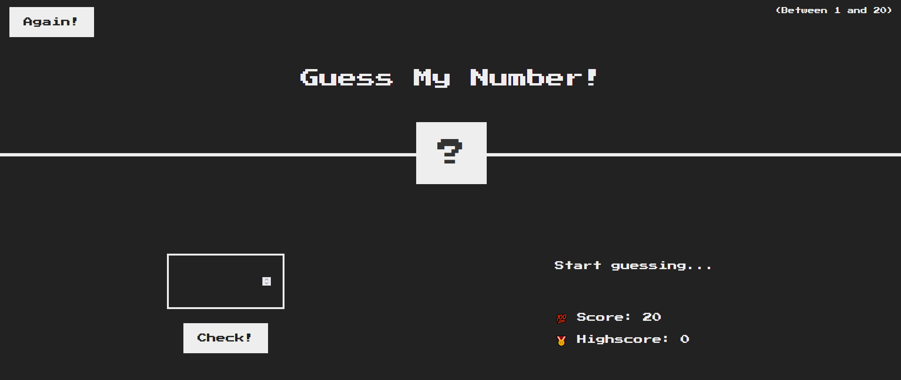
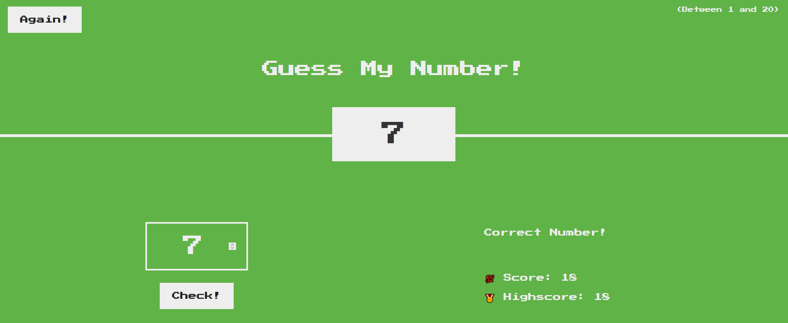

# [Guess My number](https://patriciazan.github.io/GuessMyNumber-JS-Course/)
**ENG**

This is the first project made during the course ['The Complete JavaScript Course 2024: From Zero to Expert!'](https://www.udemy.com/course/the-complete-javascript-course/) on Udemy.[Play Game](https://patriciazan.github.io/GuessMyNumber-JS-Course/)

In this project a game was created to guess a random genareted number between 1 and 20, when the number is missed being too hight or too low the score will be reduced by 1 and another attempt for the number can be made, now knowing if the guess was too high! or too low!
When the correct guess is reach your current score will be added to the Highscore, if the game is beated by a better score the highscore will be updated.

This project focuses on learning:
 - Event delegation
 - Logical thinking

**PT-BR**

Esse é o primeiro projeto realizado no curso ['The Complete JavaScript Course 2024: From Zero to Expert!'](https://www.udemy.com/course/the-complete-javascript-course/) na Udemy.[Jogar](https://patriciazan.github.io/GuessMyNumber-JS-Course/)

Este mini jogo funciona para adivinhar um número aleatório entre 1 e 20, quando o número é incorreto a pontuação(score) será subtraida por 1 e uma mensagem de 'too high!'(muito alto) ou 'too low!'(muito baixo) será apresentada na tela.
Quando o número correto for adivinhado a pontuação atual será salva como o novo 'Highscore'(pontuação mais alta). Se o jogo for vencido por uma pontuação melhor o Highscore será atualizado.

Esse projeto focou no ensino de:
 - Delegação de eventos
 - Pensamento lógico

_The starting state of the game(O estado inicial do jogo)_
 
_The  final/winning state of the game(O estado final/vitorioso da partida)_
 